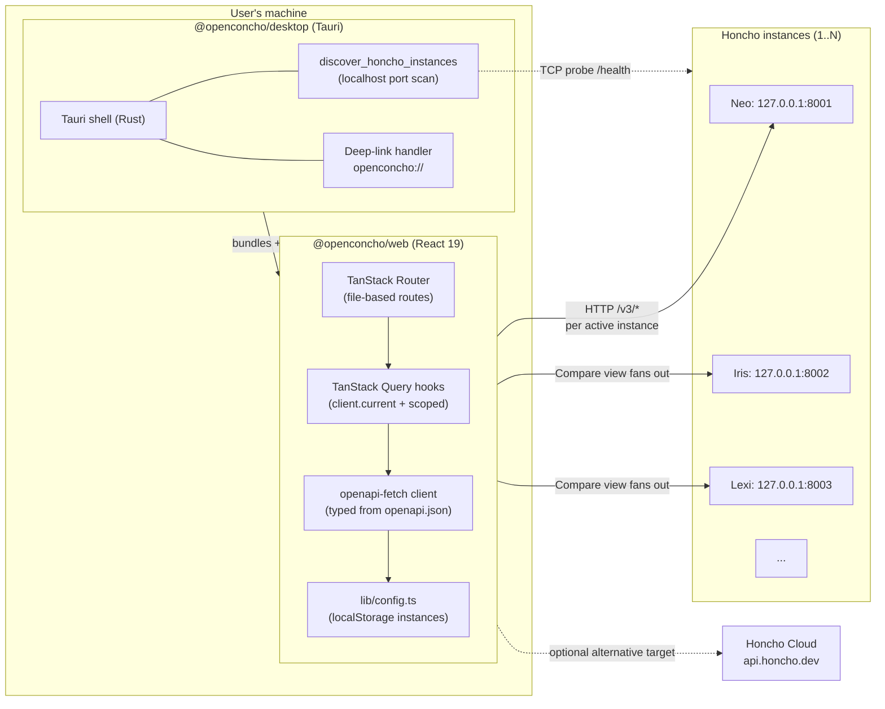
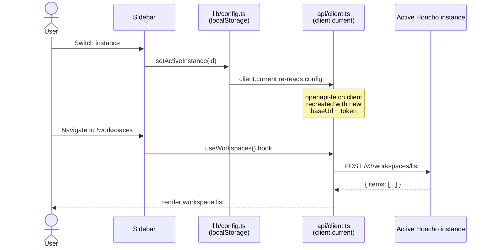
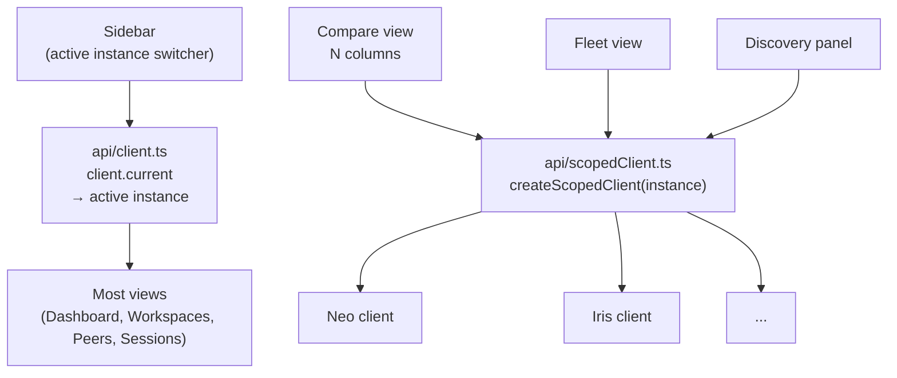

# Architecture diagram

High-level system map. Render in any Markdown viewer that supports Mermaid (GitHub does this natively).

## Component overview

## Data flow

## External dependencies

| Dependency | Where it appears | Why it matters |
|---|---|---|
| Honcho REST API | All query hooks under `packages/web/src/api/` | Source of truth for memory data. Schema lives in `packages/web/openapi.json`. Regenerate types via `pnpm --filter @openconcho/web generate:api` after updating. |
| Honcho Cloud | `lib/config.ts:HONCHO_CLOUD_URL` | Hosted alternative to self-host. Sidebar marks it specially in `isCloudInstance()`. |
| Tauri v2 | `packages/desktop/src-tauri/` | Desktop shell. Native HTTP requests (no browser CORS), enables port-scan discovery. |
| Anthropic API | `.github/workflows/ai-review.yml` | AI PR reviewer. Requires `ANTHROPIC_API_KEY` repo secret. Read-only tool allowlist. |
| GitHub Actions | `.github/workflows/{ci,release,ai-review}.yml` | CI/CD shared truth. Dependabot updates the action pins weekly. |

## Multi-instance scoping (Phase 2 + Phase D feature stack)

The default path (`client.current`) reads the *active* instance from `localStorage`. The Compare view and AI/feature views that fan out across the fleet use `createScopedClient(instance)` from `packages/web/src/api/scopedClient.ts` to bind a query to a specific non-active instance. Query keys are scoped by instance ID (`["compare", inst.id, ...]`) to prevent cache collisions across instances.

