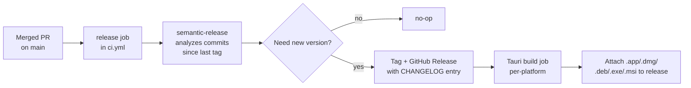

# Deployment

How releases work end-to-end. Updated when the release pipeline changes.

## Release model

OpenConcho ships **two artefacts** per release:

1. **`@openconcho/web`** — web bundle from `pnpm --filter @openconcho/web build`. Distributed only via GitHub Releases as an artifact; not currently published to npm.
2. **`@openconcho/desktop`** — Tauri-bundled `.app` (macOS), `.dmg` installer, `.deb` / `.AppImage` (Linux), `.exe` / `.msi` (Windows). Distributed via GitHub Releases.

Both are versioned together — there is one `version` field in the workspace root `package.json`.

## Release pipeline



`semantic-release` decides whether to release based on commit types since the last tag:

| Commit type | Version bump |
|---|---|
| `fix:` | patch |
| `feat:` | minor |
| `feat!:` or `BREAKING CHANGE:` in body | major |
| `chore:` / `docs:` / `style:` / `refactor:` / `test:` | none |

## What `semantic-release` does on merge to `main`

Configured in `.releaserc.json`:

1. **`commit-analyzer`** — reads commits since last tag, decides bump
2. **`release-notes-generator`** — generates a markdown changelog from conventional commits
3. **`@semantic-release/changelog`** — writes `CHANGELOG.md`
4. **`@semantic-release/npm`** — bumps `package.json` version (no publish)
5. **`@semantic-release/exec`** — runs custom build/bundle steps for desktop binaries
6. **`@semantic-release/git`** — commits the version bump + changelog back to `main`
7. **`@semantic-release/github`** — creates the GitHub Release, attaches assets

Requires `RELEASE_TOKEN` repo secret (a GitHub PAT with `repo` + `workflow` scopes), set as a repo secret separately from `GITHUB_TOKEN` because the auto-provisioned `GITHUB_TOKEN` can't trigger downstream workflows (semantic-release's commit back to `main` would otherwise be silenced from triggering subsequent CI).

## Environment variables

Set as repo secrets in Settings → Secrets and variables → Actions.

| Secret | Used by | Required for | Notes |
|---|---|---|---|
| `RELEASE_TOKEN` | `.github/workflows/ci.yml` release job | Releases on push to `main` | GitHub PAT with `repo` + `workflow` scopes. Used because `GITHUB_TOKEN` can't trigger downstream workflows. |
| `ANTHROPIC_API_KEY` | `.github/workflows/ai-review.yml` | AI PR reviewer | Each review call costs ~\$0.20–0.60 in Opus tokens. |
| `GITHUB_TOKEN` (auto) | All workflows | Standard auth for `gh` CLI, checkout, etc. | Provisioned by GitHub Actions; no manual setup. |

No runtime environment variables — connection config lives in the user's localStorage (`openconcho:instances`).

## Manual release (when semantic-release is bypassed)

If you need to cut a release manually (e.g. for a hotfix that's already on `main`):

```bash
# In a worktree off main:
git fetch origin main
git worktree add ../openconcho-release-X.Y.Z origin/main
cd ../openconcho-release-X.Y.Z

# Bump version manually (root package.json)
pnpm version X.Y.Z

# Build artefacts
pnpm --filter @openconcho/web build
pnpm --filter @openconcho/desktop build

# Tag and create the GitHub release
git tag vX.Y.Z
git push origin vX.Y.Z
gh release create vX.Y.Z \
  --title "vX.Y.Z" \
  --notes-file CHANGELOG-vX.Y.Z.md \
  packages/desktop/src-tauri/target/release/bundle/macos/OpenConcho.app \
  packages/desktop/src-tauri/target/release/bundle/dmg/OpenConcho_X.Y.Z_aarch64.dmg
```

Manual releases bypass commit-message analysis, so the version doesn't have to follow `semantic-release`'s rules. Use sparingly — they desync the changelog.

## Build artefacts and paths

After `pnpm --filter @openconcho/desktop build`:

```
packages/desktop/src-tauri/target/release/
├── openconcho                                          (binary, native)
└── bundle/
    ├── macos/
    │   └── OpenConcho.app                              (Apple Silicon native bundle)
    ├── dmg/
    │   └── OpenConcho_<version>_aarch64.dmg            (Apple Silicon installer)
    └── share/                                          (Linux resources, if cross-built)
```

After `pnpm --filter @openconcho/web build`:

```
packages/web/dist/                                      (static assets)
├── index.html
├── assets/...
```

## Tauri code signing

**Currently unsigned.** macOS Gatekeeper blocks first-launch with "OpenConcho cannot be opened" — workaround: right-click → Open the first time.

To enable signing (future):
1. Acquire an Apple Developer ID Application certificate
2. Add `signingIdentity` to `packages/desktop/src-tauri/tauri.conf.json`
3. Notarize via `xcrun notarytool` post-build
4. CI needs `APPLE_CERTIFICATE`, `APPLE_CERTIFICATE_PASSWORD`, `APPLE_SIGNING_IDENTITY`, `APPLE_ID`, `APPLE_PASSWORD`, `APPLE_TEAM_ID` secrets

Documented but not implemented — overkill for solo / small-team distribution.

## Rolling back a release

`semantic-release` doesn't support automatic rollback. To revert:

1. Identify the bad release tag (e.g. `v0.9.1`)
2. Delete the GitHub release: `gh release delete v0.9.1 --yes`
3. Delete the tag: `git tag -d v0.9.1 && git push --delete origin v0.9.1` *(requires temporarily disabling branch protection on tag deletion if enabled)*
4. Open a `fix:` PR reverting the bad commits — next merge to `main` will produce a patch release that supersedes

Do NOT force-push `main` to remove the commits — branch protection blocks it, and even if bypassed, `semantic-release`'s version-history coherence breaks.

## Where releases live

- Tags + assets: https://github.com/BenSheridanEdwards/openconcho/releases
- Changelog: `CHANGELOG.md` (auto-generated; do not edit by hand)
- Version history: `git log --tags --simplify-by-decoration --pretty='%ai %d'`
