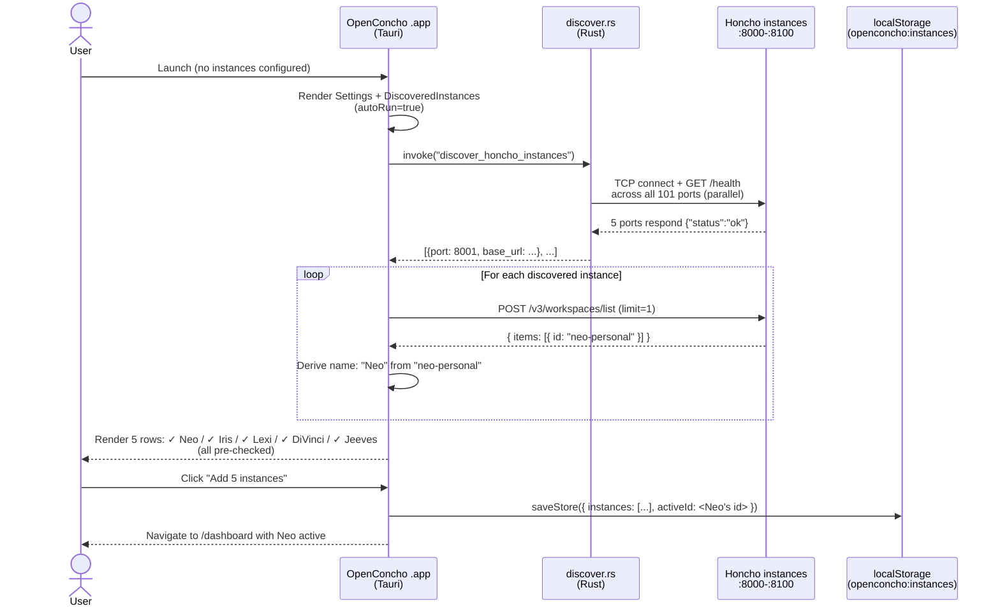
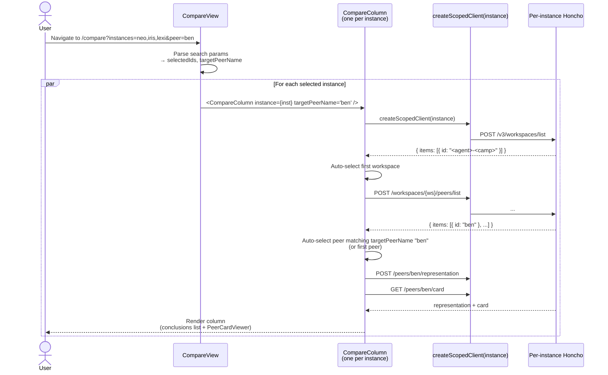
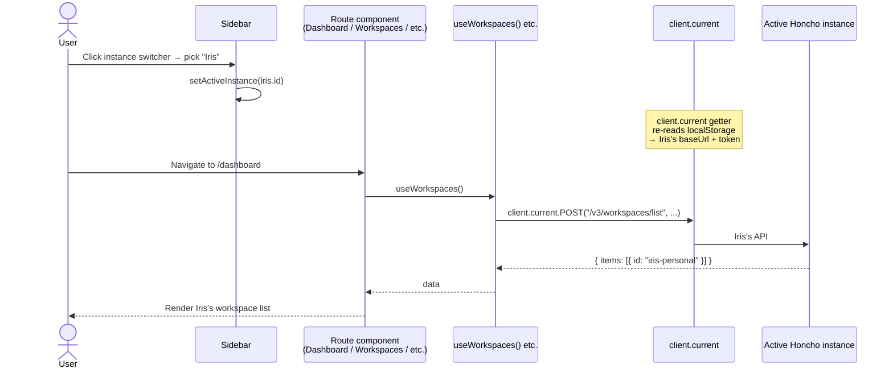

# Core user flows

The main journeys through openconcho. Each diagram is Mermaid (renders inline on GitHub) plus a short narrative.

## 1. First launch — auto-discover and add fleet

The killer first-run flow on the desktop build.



## 2. Compare peer representations across the fleet

The Compare view answers "how does my agent fleet's model of *me* differ across agents?"



## 3. Active-instance scoped browsing (Dashboard / Workspaces / Peers / Sessions)

The default path. Most of the existing app.



Note: this is why **Dashboard only shows one workspace at a time** — it's scoped to the active instance by design. The Compare view (#2) and Fleet Dashboard (planned) are the multi-instance views.

## 4. Connection health detection

How `<HealthDot />` and the settings form know whether a configured instance is reachable.

```mermaid
flowchart TB
    Start([Settings form: Test connection])
    Start --> Probe[POST /v3/workspaces/list<br/>5s timeout]
    Probe -->|200 OK| OK[status: "ok"<br/>Connected]
    Probe -->|401 or 403| Auth[status: "auth-required"<br/>Show token field]
    Probe -->|other 4xx/5xx| Unreach[status: "unreachable"<br/>Server returned X]
    Probe -->|timeout / network| Down[status: "unreachable"<br/>Cannot reach server]

    OK --> Save[Save instance to localStorage]
    Auth --> Token{User provides token?}
    Token -->|yes| Probe
    Token -->|no| Save
```

## 5. Dream consolidation (read-side surfacing)

Currently a black box — Phase 9 spawn-task "Live dream progress viewer" (PR #10) is closing this. Documented here so the architectural intent is in writing.

```mermaid
sequenceDiagram
    participant Cron as Honcho dream scheduler<br/>(every 8h per agent)
    participant Dreamer as Dreamer worker<br/>(off-queue)
    participant Conclusions as Per-peer conclusions
    participant Card as Peer card
    participant App as openconcho UI

    Cron->>Dreamer: process_dream(workspace, peer)
    Dreamer->>Conclusions: read recent observations
    Dreamer->>Dreamer: DeductionSpecialist<br/>→ create_observations_deductive
    Dreamer->>Dreamer: InductionSpecialist<br/>→ create_observations_inductive
    Dreamer->>Card: update_peer_card

    Note over App: Next render of the peer<br/>shows new conclusions<br/>+ updated card

    App->>App: useQueueStatus polls /queue/status<br/>(10s; Phase 7 chip will adapt to 2-3s<br/>when dreams active)
```
